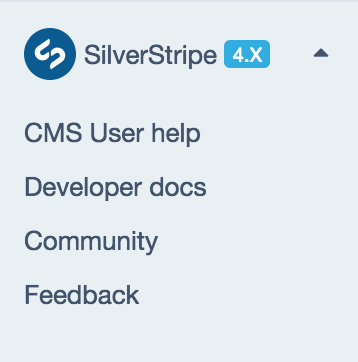
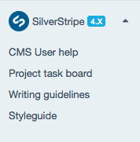

title: Overview
summary: Introducing the SilverStripe CMS administration interface.

# Overview

The latest SilverStripe CMS administration panel is arranged in four main areas, as shown below:

## CMS menu

This CMS menu allows you to navigate to the main sections of the SilverStripe CMS. The CMS menu can be collapsed by using the toggle at the bottom left of the screen. By default the CMS menu provides you access to your sites pages, files and images, reports, manage security of its members and admins, adjust site settings and the CMS Help menu.

The menu you see may change depending on what modules are installed and what permissions your user account has been assigned. The following tabs are part of a typical SilverStripe installation for a user in the [Administrators](managing_roles_and_permissions/#using-roles) group with full permissions:

### Pages

This section enables you to order, remove, and add pages. When you have a page selected you can edit the content, publish, unpublish or archive a page among many other things.

### Campaigns

This section allows you to create and group new content together to be released all at once. For example, this might include several pages, images and blocks of content that need to be published at the same time across your website for a promotion.

### Files

This section allows you to add or delete files and to synchronise your view with the actual files on the server. You can also organise your files into folders.

### Reports

This section shows reports for your site such as, pages with broken links or pages with no content. What you see in this section will depend on which version of SilverStripe you are running and what modules you have installed.

### Security

The Security section enables you to set up and administer users and user groups as well as control access to various pages or sections. You can also upload these settings in the form of a CSV file.

### Settings

Here is where you can manage some global settings like the site name and user access control.

### CMS Help menu

The CMS Help menu provides more visibility of useful resources in the wider ecosystem of SilverStripe and can be found in the south toolbar of the CMS menu. The CMS help menu includes the following:

CMS User Help — direct access to SilverStripe User Help. This is the site you are looking at right now!

[Developer Documentation](https://doc.silverstripe.org) — often used by administrators when the user help guides don't surface enough information.

[Community](https://silverstripe.org) — provides awareness of self-help areas such as the community [Slack](https://www.silverstripe.org/community/slack-signup), [StackOverflow](https://stackoverflow.com/questions/tagged/silverstripe), [Forum](https://forum.silverstripe.org/) through the community website.

[Feedback](https://www.silverstripe.org/give-feedback/) — give feedback about the SilverStripe CMS whether good or bad, we'd be happy to hear your thoughts. Your contributions will help improve the experience of the CMS for everyone.

The CMS help menu also provides visibility of the CMS version number. It is directly visible in the menu and shows the full version details on hover.

#### Customising the CMS Help menu

The help links are also configurable making it easy for agencies to edit, add or remove existing links. This will need to be set up by a developer.

See, [Customising the CMS Help menu](https://docs.silverstripe.org/en/4/developer_guides/customising_the_admin_interface/how_tos/customise_cms_menu/#customising-the-cms-help-menu) to learn more.

## Areas within the Pages section

### Tree Management

The Tree Management area is found between the CMS menu and page details, and displays as a site tree in a hierarchical format. If a page is selected in the tree its details will be shown in the Page Management area. You can rearrange your page hierarchy. The site tree will indicate if a page is Draft, Modified, or Archived by a page status, if a page is published no status will be shown. Because pages can be placed 'beneath' one another in the hierarchy, you may need to expand items in the tree to see items beneath them.

### Page Management

The Page Management area shows various data relating to individual pages such as: page name, navigation label (label in the website menu), URL and general content. The content of each page is typically edited through a text editor (HTML editor), which behaves in a similar fashion to a word processing application (such as Microsoft Word). Content authors can also select to edit the page's html directly through the editor.

#### Publishing Bar

The Publishing bar on the bottom of the page allows you to save, publish (make publicly available), unpublish (return to draft), unpublish and archive (remove from site tree) or add the page to a Campaign.

### Edit mode toggle and page preview

You can choose to view the interface in a few different ways, including Edit mode, Split mode (side-by-side edit and preview) or Preview mode (preview only). Within the preview area you can also toggle between preview states ***Draft*** and ***Published***.

See, [Previewing content changes](../creating_pages_and_content/creating_and_editing_content/previewing_changes) to learn more.
