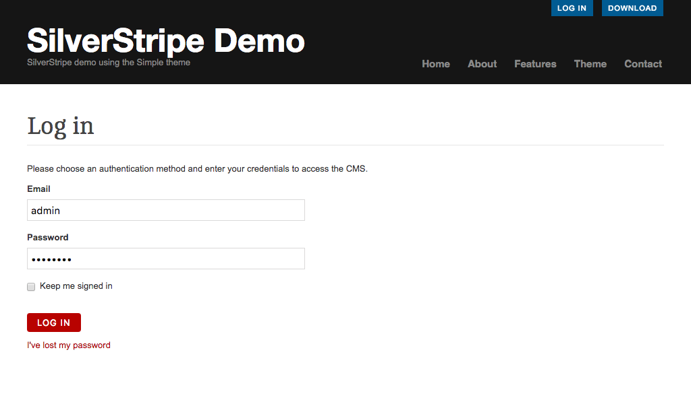

# Logging In

Hello, and welcome to the Silverstripe CMS User Help. Hopefully, you can find the topic you're looking for in the sidebar. Alternatively, you can use our search function above.

If you have not yet installed Silverstripe CMS, but want to follow along, you can use our interactive demo at [http://demo.silverstripe.com/](http://demo.silverstripe.com/admin).

To access this help guide, click the button ***Help*** from your Silverstripe CMS menu at any time.

## Logging in to the CMS

To access the Silverstripe CMS, you need a username and password. Usernames and passwords can only be given by the site's administrator. If you don't have a username or password, contact the person or organisation that created the website.

Open your web browser. It is best to use the latest version of your browser for the best experience.

To navigate to the login page for the site administration, type in your website address, and add "/admin" to the end. For example, if your website is www.example.com, your login page would be found at www.example.com/admin.

Enter your login (usually your email address) and password. This will take you to the CMS main screen.

*Page viewable by browsing to www.example.com/admin*

## Staying signed in ("Remember Me" functionality)

If you select the **Keep me signed in** checkbox field, you will be automatically signed in the next time you visit the site.
Only use this option on a computer where you alone have access.

Additional information:

* When checking this option you will stay signed in for 30 days by default.
* You can stay signed in on multiple devices by default.
* Logging out of one device will clear automatic sign-ins on all of your devices by default, which means you will need to log in again next time.
* These features may behave differently based on how the developers / administrators have configured them.

## Lost Password

If you can't remember your password, click the link ***I've lost my password***. You'll be asked to enter your email address and will receive an email with a link that allows you to reset your password.

If you are managing other CMS users and want to reset a password for somebody else, refer to [Changing and Managing Users](changing_and_managing_users/).
