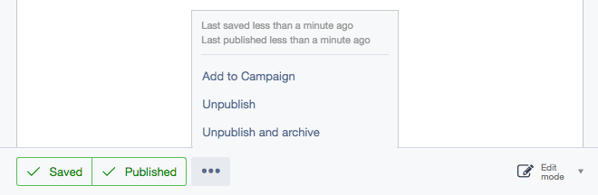

# Archiving a page
Any page in the CMS can be archived, which removes it from the site, but retains the page in the internal version history.

### Archiving pages

1. Select the page you want to archive, click the button ***More options*** which is shown as a ellipses icon in the Publishing bar.
2. Click the button ***Unpublish and archive***. You will then be presented with a ***Restore draft*** button if you want to undo this step.

The page will be removed from the live version, no longer editable as a draft, and will be shown in the site tree with the label **Archived**. The newly archived item will eventually disappear from the site tree, however it is still possible to recover any archived pages at a later date, see [Restoring archived pages](restoring_archived_pages) to learn more. The archived page will no longer appear in the site tree if you navigate away from the archived page and the interface is reloaded.

