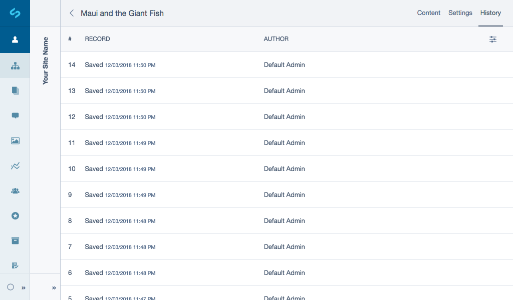
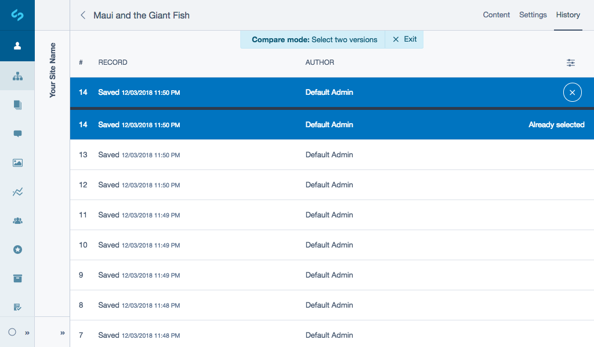
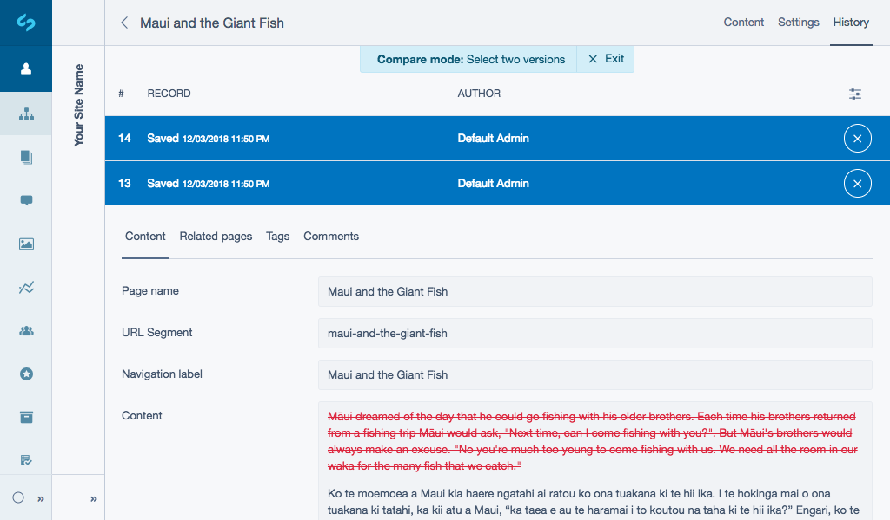

# Rolling Back to a Previous Page Version

Anytime you Save or Publish a snapshot of the page is created that can be rolled back to at any point in the future. This is useful for reverting any saved changes or recovering any content that had previously been removed.

## Rolling back

1. Select a page you want to roll back to in the site tree and navigate to the ***History*** tab. You will see a list of each version of the page, along with the pages date, and the author.
2. Select a version to preview. The latest version that was published will be displayed with a **Live** badge.

You can preview how the current snapshot looked on the site, by switching to **Preview** mode using the edit mode toggle.

3. Click the button ***Revert to this version***, once you have located the snapshot that you want to roll back to.
4. The page will be rolled back to this version. Click the button ***Publish*** to make it live.

[note]
When a page is rolled back to the previous version, it is only rolled back in the backend CMS as a draft. To show the rolled back page on the public-facing website, it needs to be published.
[/note]

## Comparing Snapshots

To see exactly what was changed between 2 different versions of the page:

Navigate to the ***History*** tab, to enter **Compare mode** you can either:
* Click the button ***Compare mode*** shown as a slider icon and select the ***Compare two versions*** checkbox field or
* Select a record from the list and click the button ***Compare***.

Once you have entered compare mode select 2 different records.
**Note:** Your selected record will automatically be positioned at the top of the page separated by a black bar. Your record will also appear in the below list with the label **Already selected**. Select another record to compare versions.

The preview will then highlight everything that has been removed from the page in red, and everything that was added in green between those two versions in a read-only format.

To deselect a record, select the button ***Close*** shown as a cross icon.
To exit compare mode entirely select the button ***Exit*** in the notice message ***Compare mode: Select two versions*** below the north toolbar.
