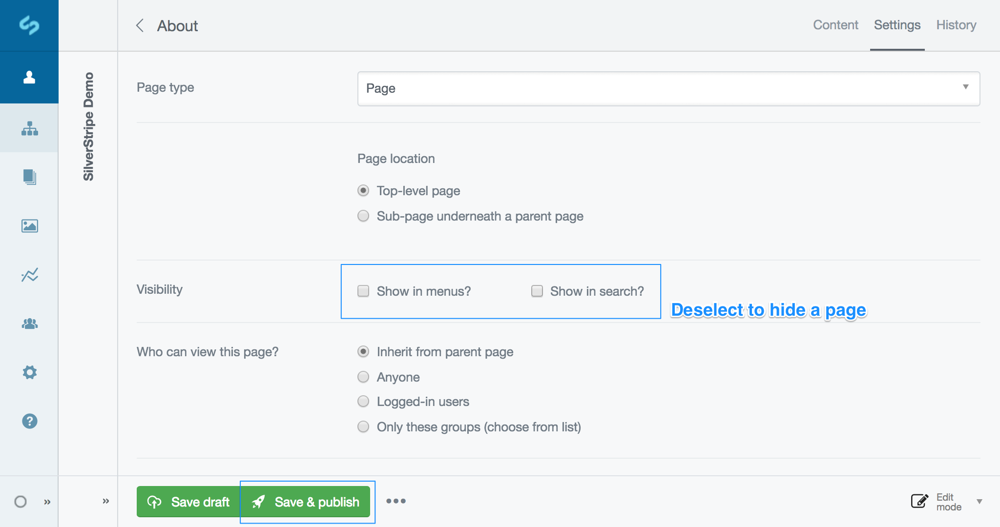

# Hiding a Page (From the Menus)

## Quick Reminder

 1. While in the editing mode for a page, click on the  tab in the top right.
 2. Next to **Visibility** untick the **Show in menus?** checkbox.
 3. Click in the **Page Priority** dropdown, and select **Not Indexed** to hide from search engines too.
 4. Click 

## Hiding pages

 1. While in the editing mode for a page, click on the  tab in the top right.
 2. Next to **Visibility** untick the **Show in menus?** checkbox. This shall stop the page appearing in your website navigation menus. Note: You can tell which pages are hidden this way, as they are usually marked in gray in the site tree.
 3. Click in the Page Priority dropdown, and select Not Indexed. This shall stop the page from appearing in search engine results. Note: If changing this on an existing page, it may take a few weeks for the page to disappear from search engine results.
 4. Click 

Now only people who know the full URL of the page shall be able to find it. However, you can still link to the page from other pages using the [Insert Link](../creating_and_editing_content/inserting_links) option.

[note]
You can choose to hide the page from the menus or from search engines, you do not need to do both.
[/note]

 

