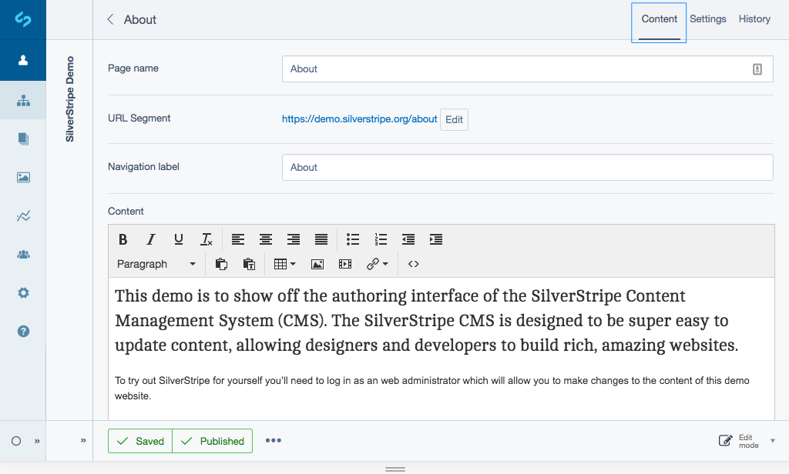
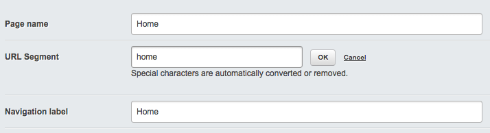
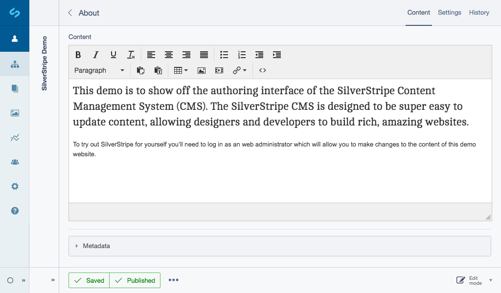
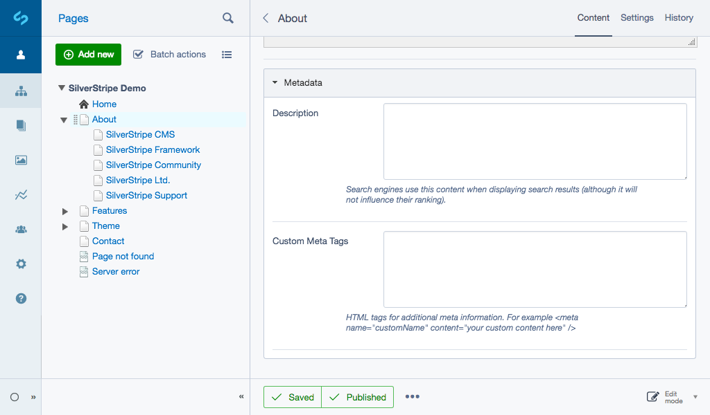

## Editing content

If your website includes other features specific to all pages you may see other fields here too.

1. In the **Pages** section, select the page you want to edit in the site tree.
2. Navigate to the ***Content*** tab. For a standard content page, you can edit the following fields:
* **Page name**—appears at the top of the page, above the content.
* **URL segment**—the website address for the page.
* **Navigation label**—how the page is labelled in the website navigation menu, usually the same as the Page name.
* **Content**—main content for the page, can include structured text, images, links, lists etc.
* **Metadata**—hidden in a panel at the bottom of the interface, the content of these fields don't appear on the page, but instead are used by search engines.
3. Add your required field changes and click the button ***Save*** or ***Publish***.

[note]
Every time you click the button ***Save*** or ***Publish*** a snapshot of the page is saved in history, which you can then revert to at any time, see [Rolling Back Pages](../pages/rolling_back_pages) to learn more.
[/note]

## Formatting content

Generally, most items in the HTML editor will behave much like they would in any word processor.

### Styles

The Styles dropdown field allows you to add certain styles to a page. This is primarily used to add image styles to a link of downloadable content, for example, links to PDF or Word documents, Excel spreadsheets, or images.

The Paragraph dropdown field allows you to choose a format for that paragraph in HTML code. Most typed paragraphs will be in the normal paragraph format, but there are also six levels of headings.

### Headings

Headings represent the outline structure of a document. H1 is generally considered the highest level of the document, while H6 is the lowest level. By using the Heading paragraph formats, it will automatically make all paragraphs marked with the same heading number the same format. If you want to change the style of your page at a later date, you will only need to change the heading definitions in one place, rather than changing the format of multiple headings in your text individually.

### Blockquote

Blockquote which is shown as a quotation mark is used to offset text which are commonly known as pull-quotes. Simply highlight the text you want to offset, and click the button ***Blockquote***.

### Horizontal Ruler

Insert horizontal ruler will insert a horizontal line on the page, and the button ***Insert special character***, marked by the Greek Omega symbol, is used to insert special characters into the text. This is useful for foreign loanwords with special symbols, such as "resumé," proper names such as "François Mitterrand," and metal umlauts, such as "Mötley Crüe".

### HTML

If you want to edit the source code of the page directly, click the button ***HTML*** shown as a code icon to bring up the HTML source of the page. It is recommended that you only do this if you have a good knowledge of HTML formatting. This can be useful when you need to directly add some source code to a page, for example, when embedding YouTube videos.

### Cutting and pasting from a Word Processor

You may want to bring some text you have already written on a word processor, such as Microsoft Word into your page content.

Generally, you can paste any text from a plain text editor such as Notepad.exe on Windows systems, TextEdit.app on Macintosh systems, and gEdit on Ubuntu Linux, and others.

Pasting directly from most word processors or other application often inserts "rich text" formatting code that usually doesn't work well with the HTML markup code used on websites.

To remove this additional formatting, you can use the **Paste as text** option.  This removes all formatting from copied text before adding it to the website.

## Describing your content with metadata

It's not just enough to create good content that informs your readers. You also need to let your readers find the content they're looking for. You can help your readers find your content by adding metadata. Metadata is page-specific blocks of text, normally hidden from general browsers, which search engines use to classify the page on the internet.

In the lower portion of the Navigation toolbar, beneath the HTML Editor is the Metadata section. Here, you can also enter a description and keywords for your site and add any additional metadata.

