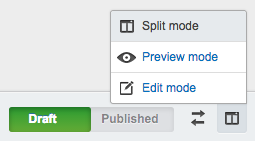
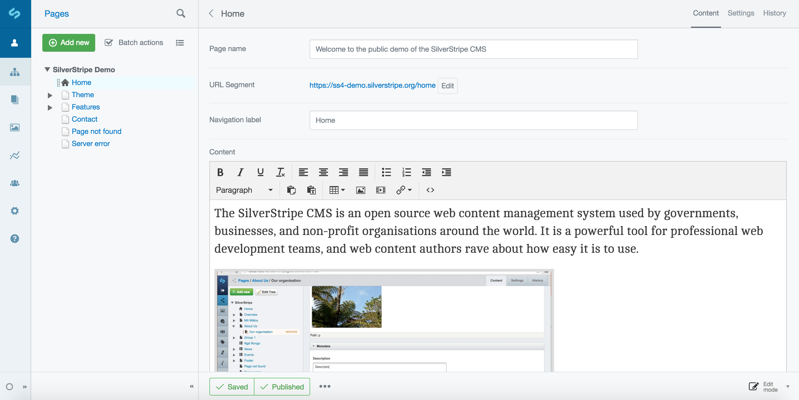

# Previewing changes

[note]
 
**Remember to save early and often.**
[/note]

## Quick Reminder

 1. Click on the  button.
 2. Click on the mode toggle icon: 
 3. Click 
 4. Click on Draft site: 

## Previewing your changes

After you save your page as a draft, you can preview the page by clicking on "Preview mode" or "Split mode" in the side by side preview menu.

This will allow you to view a preview of your draft content alongside your editable form. That way you can make
live updates to the draft site and see the preview immediately.

