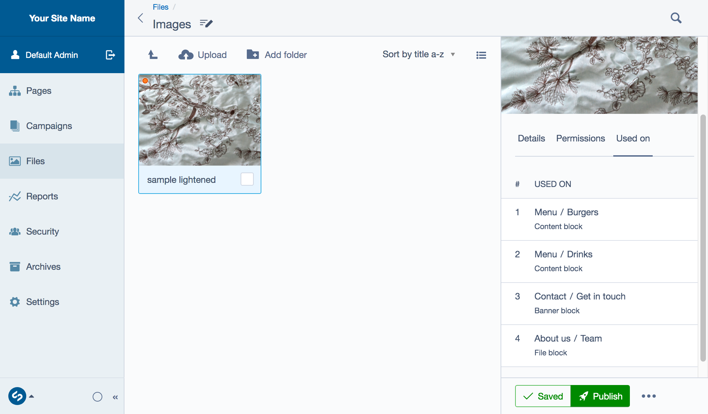

# Working with files (images and documents)

## Managing files

Files are typically managed within the Files section of the CMS. This section shows a library of files available to use on your website. This includes both images and documents such as PDF files, and can also include javascript files.

Files can be displayed or linked to from multiple places. This means that by updating a file's details, all of the pages which use the file will receive those updates (both the file and page would need to be published for these changes to be seen on the live version).

You can either upload files within the Files section or directly from pages through the HTML editor. The Files section supports a range of different file types which are typical for use on the web including images, videos, and documents. See [Web content best practices](/creating_pages_and_content/web_content_best_practices/) for additional tips on how to prepare files for use on the web.

> [!NOTE]
> By default, uploaded files are placed in the "Uploads" directory.
> If you place an image in a page, and later move or rename that image the CMS will automatically keep track of those changes, so your webpage will remain unchanged—you don't even have to republish the page.

## Uploading images

Navigate to the **Files** section in the CMS menu. You should see a grid or list of files (and folders containing files) that have already been uploaded to the CMS, otherwise you probably have an empty files area.

Before you upload your images or files you may wish to create a new folder, or navigate to an existing folder to upload a file to keep your files orderly. You can navigate up and down the folder structure by clicking on folders or clicking the back arrow.

Click the button ***Upload*** to choose your file(s) from your computer to upload, or alternatively you can drag and drop your file(s) into the main **Files** library area.

You should now see the files you uploaded within your chosen folder.

> [!NOTE]
> This same process can be used for filetypes other than images, see [Linking Documents](linking_documents/) to learn more.

## Uploading images from a page

> [!NOTE]
> Pages that contain a HTML editor allow you to place files into the content area, some pages don't have a HTML editor area by default and might require a different [Page type](/creating_pages_and_content/pages/creating_new_pages/) or for a Content Block to be added.

1. Navigate to your page within the **Pages** section.
2. In the HTML editor click on the button ***Insert from Files*** which is shown as an image icon.  
3. The Files area will open above the Navigation toolbar.
4. Navigate to the folder you would like to add your file(s).
5. Either drag files from your computer/device or click the button ***Upload*** to add your file(s).
6. Select the files you would like to add to your content, they will appear on the right side of your file library so that you can edit its details.
7. When you have finished editing click the button ***Insert***. This will place the image in your text where your cursor was in the editing section.

## Editing files

Basic functionality and options for files:
* **Alternative text** is shown if the image cannot be loaded or displayed (for example, on text-only web browsers or screen readers).
* The **Title** text field shows additional information about the image when the mouse rolls over the image. See, [Web Content Best Practices](/creating_pages_and_content/web_content_best_practices/) to learn more.
* The **Caption** field can be used to enter text descriptions of an image.
* The **location** of the file within the Files library.
* **Alignment** and **text wrapping** properties of the image.
* **Dimensions** of the image to be displayed in the site.

## File usage

The Used on tab allows a CMS content author to view the usage of a file across the CMS. Click the ***Used on*** tab in the File details panel. The first row shows this file is being used on a [Content block](/optional_features/content_blocks/) and also provides the Page name of where the Content block has been added in the CMS. To navigate to where a particular file is being used, click on the relevant row.

## Creating, deleting folders

Folders can be used to organise images and documents, and if a new folder is created, it is added to the view you are currently in. To create a new folder click the button ***Add folder*** (also shown as folder icon). The new folder will appear on the right side of the library and will require a **Folder name** before you can save it and for it to appear in the File library.

Extra care should be taken when deleting a folder as files contained within it can be deleted at the same time. There are two ways to delete a folder:

* Select the folder checkbox field and click the button ***Delete*** shown as a trash icon.
* Select a folder so its details shows in the edit panel (right of the file library), select **Delete** from the file options (accessible through the ellipsis icon).

## Searching for images and documents

To search for an image, click the button ***Search*** (shown as a search icon). Type the whole or partial search term to locate file(s). Click the button ***Advanced*** (or shown as an downward arrow) if you wish to filter by **File type**, **Last changed** or **Limit to current folder and its sub-folders** checkbox field.

