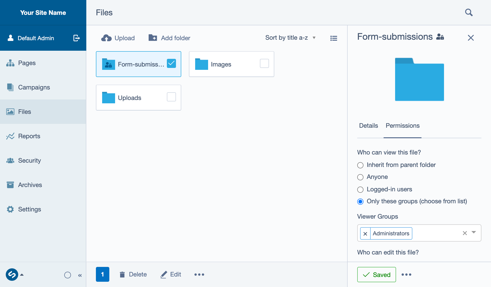

## File permissions

[note]
This functionality is specifically included in Silverstripe core functionality 4.6 and above.
[/note]

Typically files and folders in Silverstripe CMS do not have any view access permissions applied to them.
This means that when a file is published the files can be linked to, or shared on your site by anyone.
To help reduce the risk of privacy breaches of user submitted data, Silverstripe CMS has some helpful defaults to
limit the access of files uploaded to the CMS.

When certain permissions are applied to limit access of a file/folder, we refer to it as having **restricted access**.
Depending on which permission you use, the file will only be visible to one of the following groups regardless of it
 being published to the live site:

* Admins, [your custom groups...]
* Logged in users

If the option 'Anyone' is selected the file has the possibility to be visible to the Web.
We refer to this as Unrestricted or publicly viewable regardless of whether the file is placed on a page or not.

## File indicators

Files have a number of icons which can help to identify the original source of a file and whether caution should be taken when using it.

**Restricted access:** 

Indicates that a file/folder has restricted access and will only be visible to certain users or groups.

### User Forms file indicators

If you are collecting user submitted data through [silverstripe-userforms](https://github.com/silverstripe/silverstripe-userforms/)
on your site, your form submissions are more likely to contain personally identifiable information
([PII](/optional_features/forms/#data-protection-and-privacy)) which may require heightened
levels of compliance to ensure there are not any accidental data breaches.

If you have [silverstripe-userforms](https://github.com/silverstripe/silverstripe-userforms/) 5.3 and above or
[silverstripe-elemental-userforms](https://github.com/dnadesign/silverstripe-elemental-userforms) installed, you may see the following iconography:

**Form submission:** 

This indicates a file is associated with a form submission, this file could contain personal identifiable information and care should be taken so that it is not leaked.

**Form submission with warning:** 

This indicates that a file associated with a form submission does not have the recommended permissions applied to it.
A caution symbol is added to the form submission icon because it has a higher risk of being publicly accessible if it is published.

To learn more about the usage of these icons in form submissions refer to
[Form submissions, File Upload Field](/optional_features/forms/form-submissions/#file-upload-field).

Examples of where these icons can be found in Silverstripe CMS:

* Files area on file thumbnails
* File/folder details and folder heading titles
* Folders
* The Upload field component
* Below [relevant folder](/optional_features/forms/form-submissions/#changing-folders-for-individual-fields) select dropdowns

[note]
Folder with restricted access containing files with custom permissions and their associated file icons.
* FS - Form submission
[/note]
