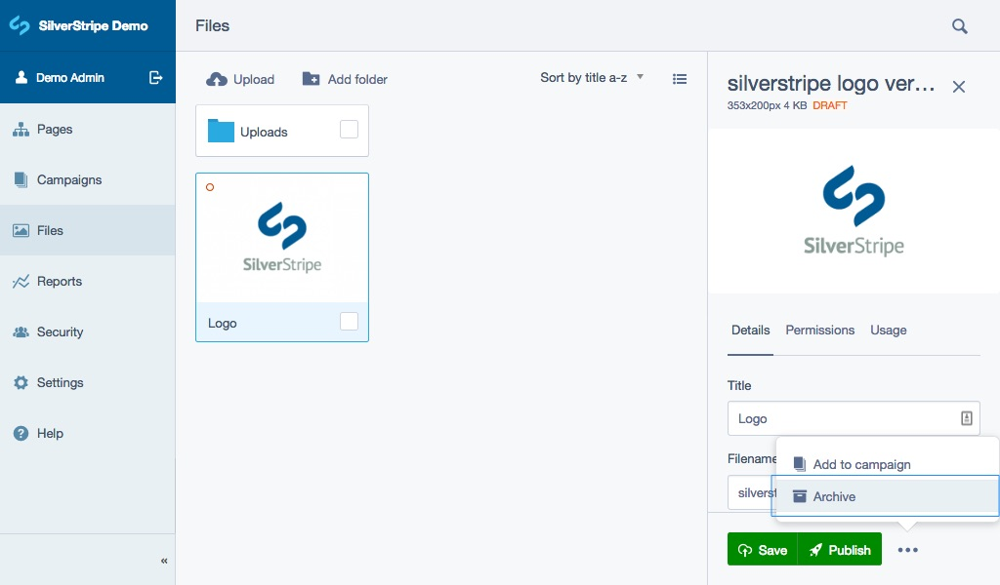
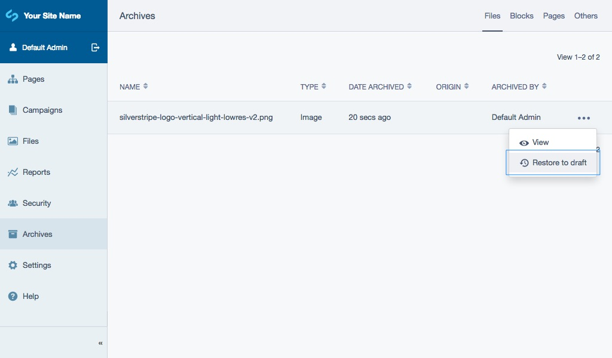
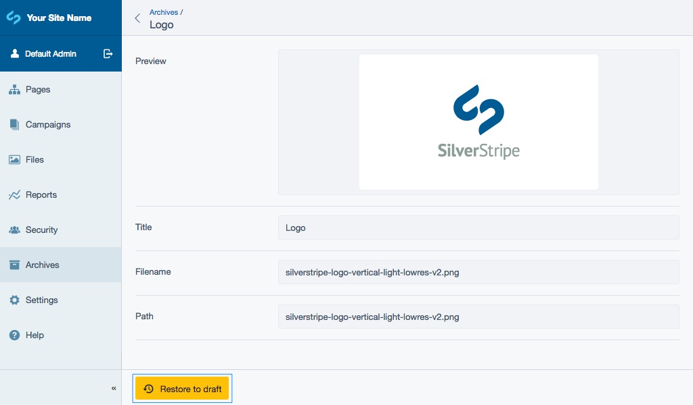

# Archive

[note]
The Archive section of the CMS is new as of Silverstripe CMS 4 and therefore will continue to develop with functionality.
[/note]

All content which can be archived is stored within the CMS Archive. By default this includes pages, files (if activated), and content blocks. Depending on the way your CMS has been configured the Archive might extend to contain additional content types.

When archiving an item, the CMS will first automatically unpublish the item if published, before sending it to the archive. The Archive stores the item along with its entire history so that it can be restored at a later date. If an item is restored then it will be returned to the relevant section of the CMS it came from in a draft state.

**Note:** Some types of content can’t be sent to the **Archive**, or the functionality has been removed. If a **Delete** action is present instead of the **Archive** action, typically the content will be removed from the CMS without a way of retrieving the information via the CMS interface, although the content will typically still be stored in the database.

## Archiving content (Pages, Files, Content blocks etc.)

1. Navigate to the item you wish to archive within its section of the CMS (for example, navigate to the page you wish to archive within the Pages section of the CMS).
2. Click the **More options** button, typically located in the Action toolbar e.g. to the right side of the Save and Publish buttons.
3. Select the **Archive** option. You will receive a confirmation notification if the the item has successfully been archived.

Location of the **Archive** action for pages:

Location of the **Archive** action for files:

[note]
Archiving for files is turned off by default.
[/note]

Location of the **Archive** action for tabled content:

## Restoring content to your website

1. Navigate to **Archive** section.
2. Select a content type.
3. Click the **More options** button.
4. Select the **Restore to draft** button. Alternatively, the **Restore to draft** button is also available after clicking into an item.

