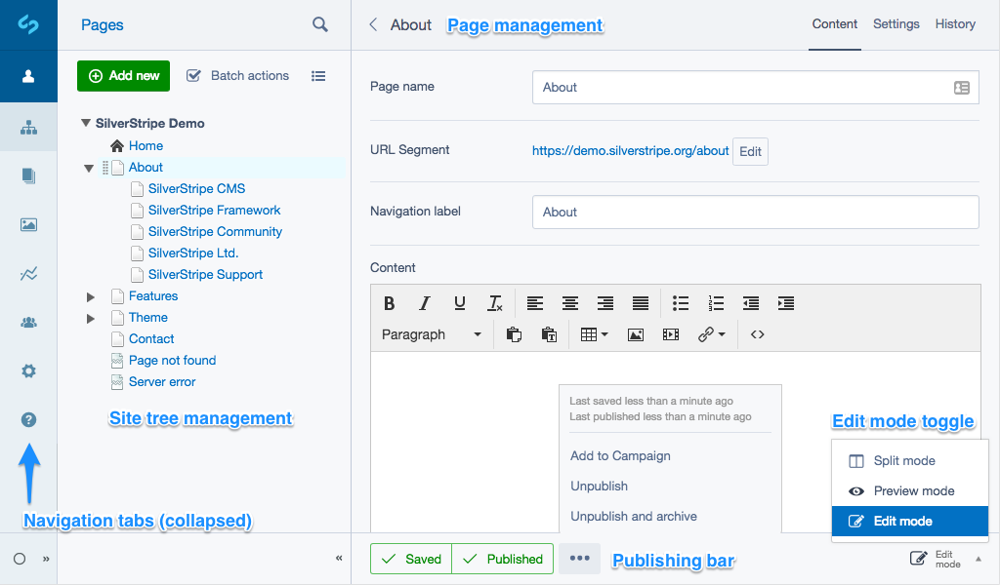

<!--
pagenumber: 2
title: Basic overview
-->

# Basic Overview

The latest SilverStripe CMS administration panel, is arranged in four main sections, shown below:

## Navigation tabs

The Navigation Tabs (found on the far left of the page) allow you to navigate to the main sections of SilverStripe CMS. Here, you can choose to manage pages or files and images, run reports or manage security, site settings and even get help.  Some modules and options will add additional tabs here. Click on the relevant tab to display the associated information in the current window.

Specific tabs may change depending on what modules are installed. However, the following tabs are part of a typical SilverStripe installation:

These tabs will generally automatically contract on smaller screens, but this can be forced
to remain open by checking the pin icon in the bottom left.

### Pages

This section enables you to access and edit the content of the pages on your website.  You can also change the order of pages, remove pages and add new ones.  While in this section, the Publishing Bar is available.

### Files 

This section allows you to add or delete files and to synchronise your view with the actual files on the server.  You can also organise your files into folders.

### Reports

This section shows reports for your site such as, pages with broken links or pages with no content. What you see in this section will depend on which version of SilverStripe you are running, and what modules you have installed.

### Security

The Security section enables you to set up and administer users and user groups, and control access to various pages.  You can also upload these setting in the form of a csv file.

### Settings

Here is where you can manage some global settings like the site name, themes and user access control

### Help

Help provides direct access to SilverStripe user help. This is the site you are looking at right now!

## Tree Management

The Tree Management area (found on the left of the page, just to the right of the Navigation Tabs) displays the Site Tree in hierarchical format. The page you are working on will be shown on the right, in the Page Management area.  Click on the page in the tree, you want to work on or add a new page.  You can also switch to 'edit' mode with the "Edit Tree" button, where you can rearrange your page hierarchy or multiple-modify page status.  Because pages can placed 'beneath' one another in the hierarchy, you may need to expand items in the tree to see all of them.

## Page Management

The Page Management area (on the right hand side of the page) shows various data relating to individual pages such as; page name, navigation label (label in the menu), URL and general content.  The text and image content of each page is edited through the TinyMCE WYSIWYG editor, which behaves in a similar fashion to a word processing application.  More advanced users can also select to edit the page's html directly.

## Publishing Bar

The Publishing bar on the bottom of the page allows you to save, archive, publish (make publicly available), unpublish or preview your work (published or draft versions).  The options for previewing the draft or the published site are shown on the bottom left of the page, when in preview mode.

