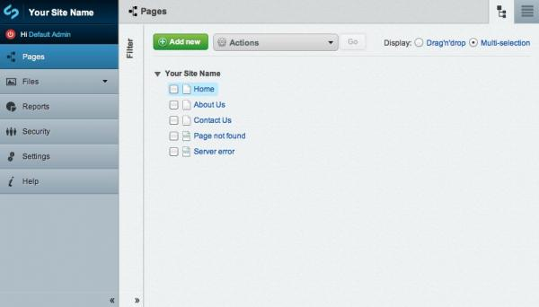
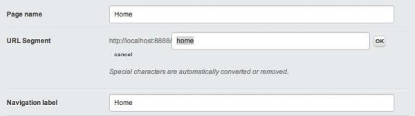
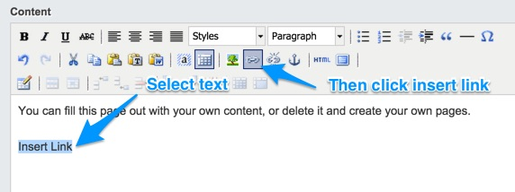

<!--
pagenumber: 1
title: Creating and Editing Content
-->

# Creating and Editing Content

## In this section

* Learn how to create a new page.
* Learn how to write content for that page.
* Learn how to describe that content for site navigation and search optimization.
* Learn how to create hyperlinks.
* Learn how to save your page as a draft.
* Learn how to publish your page to the live site. 

## Before we begin

* Make sure you are in the "Pages" section on the Navigation Tabs. 

To manage and edit any of the existing pages of the site, select the page from the site tree in the Tree Management section (by default, when you login you will be taken to the 'Page Management' Section..  Or you can add a new page by clicking on the "Add new" button:

 
### Notes:

Don't worry if you create your page in the "wrong" place.  Pages can be moved and re-ordered easily, and we will cover that under "[Managing Your Site](managing-your-site)." 

 
## Writing content

In the Page Management Section, you will need to ensure you are on the 'Content' tab to use the WYSIWYG editor:

The first field, is for the Page Name - this will define what the page will be known as in the CMS, but it will also be used to form the "default" navigation label and URL for the page, though both can be changed manually and be independent of the page name.  

Below it, you will find the URL Segment where you can specify the path this page will be known by.  Click on the 'Edit' button to change and click 'OK' when you're done.

The Navigation Label below will define what the page will show up as when listed in site navigation on the public-facing front page of your site. If you fill in the Page Name first, it will automatically put the page name in the navigation label field. It is usually, but not always, a good idea to leave it the same.  If you wish to change the navigation label but not the page name, you can do so here.  

Finally, there is the Content Box (a text-area element).  This will contain the bulk of text to appear on your webpage.  Type the text that will appear in the page on the Website.  You can also use the formatting toolbar at the top of the Content Box in order to format your page the way you would prefer.

## Formatting content

Generally, most items in the formatting toolbar will behave much like they would in any word processor.  There are a few exceptions. 

For example, the Styles drop-down box allows you to add certain styles to a page.  This is primarily used to add image styles to a link of downloadable content, for example, links to PDF or Word documents, Excel spreadsheets, or images. 

The Paragraph drop-down box allows you to choose a format for that paragraph in HTML code.  Most typed paragraphs will be in the normal "paragraph" format, but there are also six levels of "headings."  

Headings represent the outline organization of a document. H1 is generally considered the highest level of the document, while H6 is the lowest level. By using the "Heading" paragraph formats, it will automatically make all paragraphs marked with the same heading number the same format.  And, if you want to change the style of your page at a later date, your web designer will only need to change the heading definitions in one place, rather than changing the format of multiple headings in your text individually.  This can be a big timesaver!  

The "Blockquote" button (looks like " ) is used to offset text in what those in the newspaper industry call "pull-quotes." Simply highlight the text you want to offset, and press the blockquote button.  

Finally, the "Insert Horizontal Ruler" button will insert a horizontal line on the page, and the "Insert Special Character" button, marked by the Greek Omega symbol, is used to insert special characters into the text.  This is useful for foreign loanwords with special symbols, such as "resumé," proper names such as "François Mitterrand," and metal umlauts, such as "Mötley Crüe"

There is one other button that needs explanation.  That is the button marked "HTML." If you want to go in and edit the source code of the page directly, pressing the HTML button will bring up the HTML source of the page.  It is recommended that you only do this if you have a good knowledge of HTML formatting. This can be useful when you need to directly add some source code to a page, for example, when embedding YouTube videos. 

 
### Notes:

** Cutting & pasting from a Word Processor **
You may want to bring some text you have already written on a word processor, such as Microsoft Word into your page content.

Generally, you can paste any text from a "plain text editor" such as Notepad.exe on Windows systems, TextEdit.app on Macintosh systems, and gEdit on Ubuntu Linux, et al.

Pasting directly from most word processors or other application often inserts bits of "rich text" formatting code that usually doesn't work well with the HTML markup code used on Websites. SilverStripe offers two solutions to this problem.

The first is "Paste as Text." [Screenshot].  Paste As Text removes all formatting from copied text before adding it to the website.

The second is "Paste from Word," where SilverStripe takes the "rich text" formatting code from Microsoft Word, and translates that into HTML markup code. However, this only works with Microsoft Word, and not with other word processors such as OpenOffice.org, Word Perfect, or Apple Pages.  

 
## Describing your content

It's not just enough to create good content that informs your readers. You also need to let your readers find the content they're looking for. You can help your readers find your content by adding metadata. Metadata is page-specific blocks of text, normally hidden from general browsers, which search engines use to classify the page on the internet.  

In the lower portion of the Page Management section, beneath the Content Box for the page you want to describe, is the "Metadata" area. Here, you can also enter a description and keywords for your site.  If your web manager has asked you to add any additional metadata, you can do so from this section of Page Management as well.
 
## Creating hyperlinks in webpages

To create a hyperlink in a webpage, highlight the text you wish to make a link in the Editing Pane, and press the "Insert Link" button on the toolbar.  This will bring up the Link sidebar on the right side of the screen.

SilverStripe3 Content Editing (creating hyperlinks)
Creating a link to another page on the site

To link to another page on the site, choose "Page on the Site" from the list of options pop-up box that follows clicking the 'insert link' button.  You can then select the page you want to link to from the drop-down box.  Then, to confirm your action, click the "Insert Link" button.

## Creating a link to an external page

To link to a page on another website, choose "Another Website" from the list of options.  Step two will have changed to offer a text box for the URL (web address) of the page you wish to link to.  Insert the address into this box and click the 'insert link' button.

 
### Notes:

There are different processes for "internal" and "external" links because when pages on a SilverStripe installation are moved or deleted, the links in other pages on the site are automatically changed to the new pages location.  This allows you to quickly move pages around without worry of breaking the site's structure or checking every page in the site for broken links.

If you enter in an internal link URL in the external link field, SilverStripe CMS is usually smart enough to change the link to an internal link.

 
## Creating a link to an email address

To link to an e-mail address, choose "Email Address" from the list of options.  You can then paste or type in the e-mail address that you would like to link to, in the 'Details' field provided.  Then, to insert the link, click the 'Insert link' button.

 
### Notes:

One other option is to hyperlink to a document (a PDF file, DOC file, audio file, video file, or any sort of file that is not a webpage) that you have uploaded to your website. This is a more advanced topic, however, and we will cover it in "[Working with Images and Documents](working-with-images-and-documents)."

 
## Saving your page as a draft

To save your page as a draft, simply hit the "Save" button (not "Save and Publish," if it is available) in the Publishing Bar (at the bottom of the screen). Saving your page as a draft allows you to preview the page on a "Draft Site" available to you and others who have access to the CMS, but does not publish the page to the live website.  

After you save your page as a draft, you can preview the page by clicking on "Preview" in the Publishing Bar. 

**Remember to save early and often.**  

## Publishing your page, or submitting your page for publication:

If you do not have the workflow module installed, or you are the site's administrator, you can publish the page at any time by hitting the "Save and Publish" button.  Once the "Save and Publish" button is pressed, that information will go out to the live web, so be careful that you are not publishing embarrassing typos, confidential information, or anything you would generally get rebuked by your organisation's legal council for publishing. 